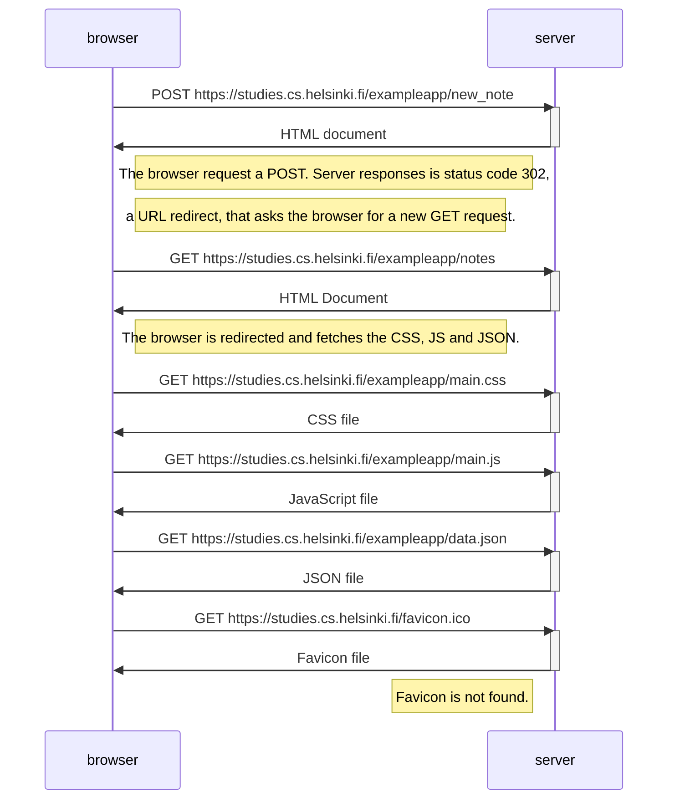

``` mermaid
    sequenceDiagram
        participant browser
        participant server

        browser->>server: POST https://studies.cs.helsinki.fi/exampleapp/new_note
        activate server
        server->>browser: HTML document
        deactivate server

        note right of browser: The browser request a POST. Server responses is status code 302, 
        note right of browser:  a URL redirect, that asks the browser for a new GET request.

        browser->>server: GET https://studies.cs.helsinki.fi/exampleapp/notes
        activate server
        server->>browser: HTML Document
        deactivate server

        note right of browser: The browser is redirected and fetches the CSS, JS and JSON.

        browser->>server: GET https://studies.cs.helsinki.fi/exampleapp/main.css
        activate server
        server->>browser: CSS file
        deactivate server

        browser->>server: GET https://studies.cs.helsinki.fi/exampleapp/main.js
        activate server
        server->>browser: JavaScript file
        deactivate server

        browser->>server: GET https://studies.cs.helsinki.fi/exampleapp/data.json
        activate server
        server->>browser: JSON file
        deactivate server

        browser->>server: GET https://studies.cs.helsinki.fi/favicon.ico
        activate server
        server->>browser: Favicon file
        deactivate server

        note left of server: Favicon is not found.
```